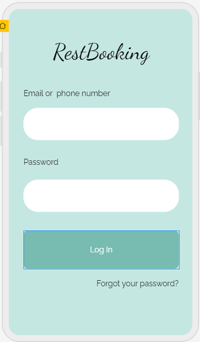

# Требования к проекту

# Содержание
1 [Введение](#intro)    
2 [Требования пользователя](#user_requirements)  
  2.1 [Программные интерфейсы](#software_interfaces)  
  2.2 [Интерфейс пользователя](#user_interface)  
  2.3 [Характеристики пользователей](#user_specifications)                                                                                           
     2.3.1 [Классификация пользователей](#user_classification)                                                                                         
     2.3.2 [Целевая аудитория](#users)                                                                                                                      
 3 [Системные требования](#system_requirements)  
  3.1 [Функциональные требования](#functional_requirements)    
  3.2 [Программные требования](#software_requirements)  

<a name="intro"/>

# 1 Введение

Название - "RestBooking".

Целью проекта является разработка мобильного приложения с простым функционалом для обеспечения возможности просмотра и бронирования столиков в кафе и ресторанах. Пользователи, которые вошли в свой аккаунт, имеют возможность просматривать информацию о заведениях, выполнять поиск мест по указанным критериям (ценовой диапазон, тип кухни, заведения), забронировать место, добавить заведение в раздел "Избранное" и написать отзыв.

<a name="user_requirements"/>

# 2 Требования пользователя

<a name="software_interfaces"/>

## 2.1 Программные интерфейсы
Продукт должен являться мобильным приложением для Android, IOS и иметь user-friendly интерфейс. Приложение должно быть реализовано с помощью фреймворка React Native.js. Интеграция карт местности будет реализована с помощью Google maps, данные пользователей  и ресторанов - в базе данных MySQL.

<a name="user_interface"/>

## 2.2 Интерфейс пользователя
Окно входа в приложение.  

Окно регистрации нового пользователя.  
  

Главное окно приложения.  
  

Окно фильтрации ресторанов по параметрам. 

  

Окно навигации для поиска ресторанов.

  

Окно страницы ресторана. 

  

Окно бронирования столика.  

  

Окно сохраненных ресторанов.  
  

<a name="user_specifications"/>

## 2.3 Характеристики пользователей

<a name="user_classification"/>

####  2.3.1  Классификация пользователей

| Класс пользователей | Описание |
|:---|:---|
| Незарегистрированные пользователи | Пользователи, которые не вошли в приложение, имеют возможность лишь просматривать информацию о заведениях |
| Зарегистрированные пользователи | Пользователи, которые вошли в приложение под своим логином (вымышленным уникальным именем пользователя), имеющие возможность забронировать место в заведении, добавить заведение в раздел "Избранное", написать отзыв о заведении |

<a name="users"/>

####  2.3.2  Целевая аудитория

Данным приложением могут пользоваться люди различных возрастных групп, которые заинтересованы в бронировании столиков в заведениях.

<a name="system_requirements"/>

# 3 Системные требования

<a name="functional_requirements"/>

## 3.1 Функциональные требования

Должны быть реализованы следующие возможности:
1. Смена языка приложения
2. Поиск мест по ценовому диапазону, типу кухни, типу заведения, наличию рядом станции метро.
3. Добавление ресторанов в раздел "Избранное".

<a name="software_requirements"/>

## 3.2 Программные требования

1. Версия React.js 16.0 и выше.
2. Версия Android 10.0 и выше.

